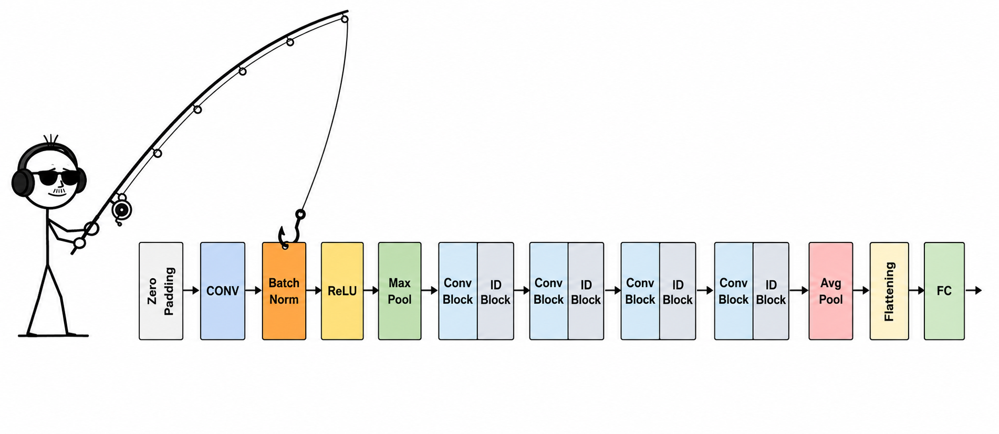

After fishing 🎣 around with forward hooks from my previous blog, I came across something interesting. Some of my intermediate layers were betraying me.. What? Yeah!

As usual, I used a forward hook with `output.detach()` to store and read the activations later:

```python
activations[layer] = output.detach()
```

(shameless plug: [read my previous blog to know how to fish activations from ANNs](https://iliyaan.github.io/posts/forward-hooks-in-pytorch.html) ;) )

That looks about right? Well, when I looked under the hood - my activations were changing!

So I researched how a forward hook really works deep under the water..

When `register_forward_hook` fires, it merely gives you a reference to the activation tensor (exact memory location). And here's when things get fishy 🐟: when you do `output.detach()` - you receive essentially a pointer to the same memory location. So even if you did `torch.equal()` on both tensors, they would show that they are the same! But their values have changed!

Consider ResNet50, which is made up of the following architecture:

{width=75%}

If we were to hook `bn1` and store it using `output.detach()` - when we read it, instead of getting its actual activations we would instead get the block's final post-ReLU activations, because the memory was changed! The ReLU is in-place in RN50, which means it modifies the input directly in memory instead of creating a separate output tensor.

## So what is the fix?

Logically, in this case: we could flip the switch on all of these ReLUs (or any similar modules) and turn them into `inplace=False`?

Well - yes, that works (at least in one case)!

Here's the catch, this only saves `bn1`, because that is the only one affected by the ReLU.

For something like `bn3`, the situation is different:

1. The hook fires and we use `output.detach()` to save a reference to it.
2. The first change: residual addition (skip connection). `out += identity` - and because `+=` is also in-place, your `bn3` changes.
3. The second change: `self.relu(out)`, which again operates in-place on the same memory.

At the end, `bn3` is the post-addition, post-ReLU output.

## The solution

```python
activations[layer] = output.detach().clone()
```

Instead of giving you a live reference to the tensor, this gives you a copy of it - making sure it's never manipulated and changed!

This issue is also not RN50-specific, or even hook-specific. It's something you should be careful of across PyTorch. If you store a reference to a tensor that has an in-place operation applied to it anywhere after, you'll get the same problem!

Well, that's it! Make sure to check if you were affected by this fishy issue.


*(First caught by [Alish Dipani](https://alishdipani.github.io/))*

*(sorry for the fishing puns)*

