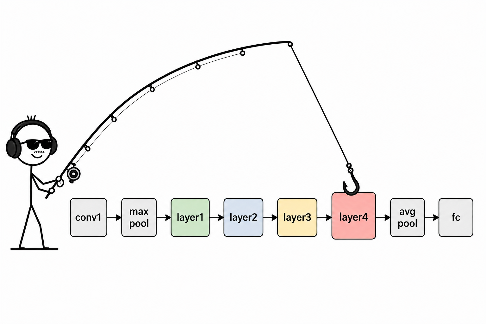

The most powerful way I have found to peek inside artificial neural networks and see how each layer activates are forward hooks. They allow you to capture intermediate layers while the program is running without modifying the model or interrupting its normal execution. This has allowed me to scale my pipelines dynamically and use the most activating intermediate layers for my research projects. 

I believe that they are a fundamental concept that everyone who wants to break into the field of computer vision and anything artificial intelligence related should know how to do. Since the applications of forward hooks are endless. For example, you could use these hooks as a way to visualize feature activation, calculate perceptual loss (useful in GANs), or simply understand how your model works. Perhaps this blog can help you think of ways you may not have thought of before.

There are also other types of hooks important to mention: just like forward hooks, there are backward hooks which allow you to peek into gradients during backpropagation, or a forward pre-hook which by its name allows you to inspect before a layer. Although, for most use cases, I think the forward hook is the most intuitive to start with.

For example, consider the artificial neural network model: ResNet50. Aside from only knowing its final outputs, we can use forward hooks to know exactly what happens at each pass.

They allow anyone to literally “hook” a layer and listen to its activations. 

{width=300px}

To apply forward hooks: we can use a neat pytorch function: [“register_module_forward_hook” ](https://docs.pytorch.org/docs/2.13/generated/torch.nn.modules.module.register_module_forward_hook.html)


```python 
model = torchvision.models.resnet50(pretrained=True) # any model here, using RN50 for example

activations = {} # dict to store activations

def call_this_function_when_layer_hits(layer):
    # this is the important hook signature:
    def hook(model, input, output):
        activations[layer] = output.detach()
        print('layer hit', output)
    return hook

# this will a hook specifically to: layer 4
hook = resnet50.layer4.register_forward_hook(call_this_function_when_layer_hits)

# normal forward pass:
out = model(X)

# important, to detach your hook! 
hook.remove()
```

Adding it to just a specific layer allows for examination of how each layer activates. This is useful for when debugging your own model, inspecting what is happening at hidden layers without altering the structure of the model
or for my case: examining the neural activations at specific layers. 

Although there are a couple downsides of this method as well, like it is important to detach the hook after a given intermediate layer if not it will cause hidden behavior that could slow down your model or affect your gradients needed for backpropagation.

That’s it for now! 
