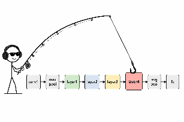
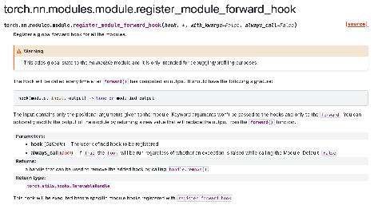

The most powerful way I have found to peek inside artificial neural networks and see how each layer activates are forward hooks. *(TODO: 1 line about why this is the most powerful)*

I believe that they are a fundamental concept that everyone who wants to break into the field of computer vision and anything artificial intelligence related should know how to do. Since the applications of forward hooks are endless. Perhaps this blog can help you think of ways you may not have thought of before.

For example, consider the infamous artificial neural network model: ResNet50. Aside from only knowing its final outputs, we can use forward hooks to know exactly what happens at each pass.

They allow anyone to literally "hook" a layer and listen to its activations.



To apply forward hooks: we can use a neat pytorch function: `register_module_forward_hook`



```
Pseudocode:
Load RN50
def call_this_function_when_layer_hits(module, input, output):
    print('layer hit', output)
# Add a code block here which is a global hook (it fires after every module's forward pass)
```

This will literally trigger for every submodule of RN50 (conv, reLU).

Since we want something specific to a certain part of the model's hierarchy: we can add it as

`handle = resnet50.layer1.register_forward_hook(call_this_function_when_layer_hits)`

Adding it to just a specific layer allows for examination of how each layer activates. This is useful for when debugging your own model, inspecting what is happening at hidden layers without altering the structure of the model, or for our case: examining the neural activations at specific layers.

*(TODO: 1-2 lines about the possible downside of this method)*

The RN50 can serve as a model for the human ventral system, and hence, we can examine the similarity of its hierarchy and its rough resemblance to our brain.

That's it for now!
